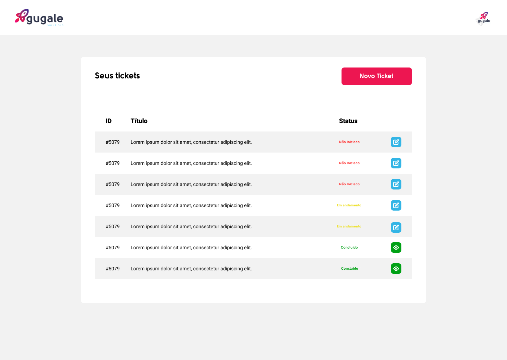

# Sobre o desafio 🚀

Nesse desafio, você precisa criar 5 telas seguindo com o máximo de fidelidade o protótipo do figma (Se encontra nos links úteis) utilizando React com typescript e styled-components (você precisa instalar essa dependência).
Você está livre para seguir com a arquitetura de código que preferir, mas lembre-se que isso também será avaliado.
Bom desafio e bom código 😀.

## Instalação

Faça o clone desse projeto.
Instale as dependência executando `yarn`.
Para rodar o app, execute `yarn start` e ele escutará em [localhost:3000](http://localhost:3000).
Pronto, após isso, só começar a codar.

## Observações

Dentro deste projeto já foi instalado e configurado o editorConfig, eslint e prettier, então é recomendado que você tenha a extensão **ESLint** instalada no seu visual studio code (caso esteja utilizando ele).
Caso você tenha a extensão **Prettier - Code Formatter** instalada, sugerimos que desinstale pois causa muitos conflitos com o prettier que já foi instalado no código.

Gostamos bastante da arquitetura e das configurações que a Rocketseat utiliza, sinta-se livre para usá-la como referência de padrões e configurações dentro do código.

## Links úteis

[Prótotipo Figma](https://www.figma.com/file/pyOr80YDQSa5GLPLVH5GBF/Gugale-Tickets?node-id=0%3A1)

[Padrões de projeto com ESLint, Prettier e EditorConfig](https://www.notion.so/Padr-es-de-projeto-com-ESLint-Prettier-e-EditorConfig-0b57b47a24724c859c0cf226aa0cc3a7)

[Typescript](https://www.notion.so/Typescript-5712aeab312d44fcba0aa88895caad36)

